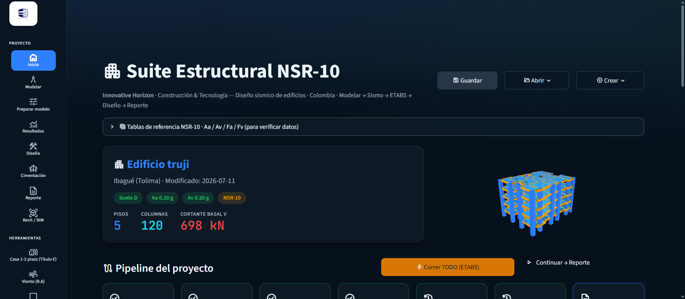
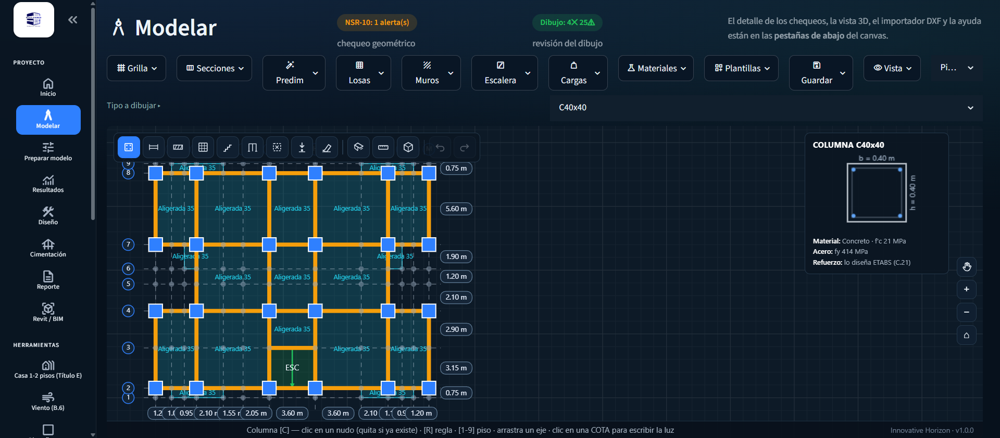
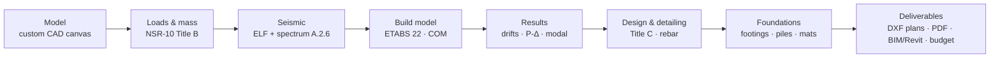

# Suite Estructural NSR-10 — Seismic Design Engine


A Python engine that automates the **seismic design of reinforced-concrete
buildings** under the Colombian building code **NSR-10**, integrated with
**ETABS 22** (CSI's structural-analysis software) through its COM API.

This repository is the **public, self-contained core** of a larger desktop
application: the pure NSR-10 calculation modules and their test suite. The full
app (Streamlit UI, live ETABS COM integration, Revit/BIM export, and client
projects) is private. Everything here runs standalone with `numpy` and the
standard library — **94 unit tests, all green**.

> Built solo as an engineering + software portfolio by a civil engineer who
> codes. Domain: earthquake-resistant design of concrete frames (NSR-10 Title A
> seismic, Title C concrete).



*Mission control: project status, live 3D model, and the seven-stage pipeline.*



*Custom CAD canvas (no external library): draw columns, beams, slabs and walls
directly, with live NSR-10 checks and a 3D view.*

---

## Why it exists

Structural design in Colombia is a repetitive loop: model the building, run the
seismic analysis, read drifts, size the columns and beams, check the code, and
iterate — by hand, across several tools. This project turns that loop into a
reproducible pipeline: one portable project file flows through seven stages, and
the sections are **found automatically** (goal-seek) to the minimum that passes
both strength and drift, verifying every step in ETABS.

## What the full application does (context)



- **ETABS COM integration** (pythonnet): builds the model, runs the analysis,
  reads results, and designs the concrete programmatically.
- **Automatic section iteration** (goal-seek): grows/shrinks columns and beams to
  the minimum section that satisfies reinforcement ratio (C.10.9.1) *and* drift
  (A.6.4), re-verifying in ETABS each round.
- **BIM export** to Revit (via Dynamo) and **IFC**, with quantity take-off
  reconciled to the kilogram against the design.
- Design modules calibrated 1:1 against professional spreadsheets: isolated /
  connected / corner footings, retaining walls, pile caps, one- and two-way
  slabs, flat plates, capacity-designed shear walls, confined masonry (Title E).

## What's in this repository (the runnable core)

| Module | What it computes | Code reference |
|--------|------------------|----------------|
| [`engine/fhe.py`](engine/fhe.py) | NSR-10 seismic spectrum + Equivalent Lateral Force (base shear, storey distribution) | A.2.6 / A.4 |
| [`engine/nsr10_data.py`](engine/nsr10_data.py) | Code tables — 32 capital cities (Aa/Av), soil factors Fa/Fv, use groups | A.2.3 / A.2.4 |
| [`engine/cortante_viga.py`](engine/cortante_viga.py) | Beam shear by capacity design (probable moments, stirrups) | C.21.5.4 |
| [`engine/secciones.py`](engine/secciones.py) | Section grammar / parsing (`C75x40`, `V30x50`) | — |
| [`engine/despiece.py`](engine/despiece.py) | Reinforcement detailing (bar selection, splices) | C.12 |
| [`engine/zapatas.py`](engine/zapatas.py) | Footing design — isolated, connected, corner, biaxial pressure | C.15 / Title H |

All pure functions, no side effects, unit-tested. The seismic core follows the
exact A.2.6 formulas (plateau `2.5·Aa·Fa·I`, descending `1.2·Av·Fv·I/T`, long
`1.2·Av·Fv·TL·I/T²`), and the footing module is validated 1:1 (0.01%) against a
professional design spreadsheet.

## Run the tests

```bash
pip install numpy
python -m unittest discover -s tests -v
```

```
Ran 94 tests ... OK
```

## Tech stack (full application)

`Python` · `Streamlit` · `pandas` · `numpy` · `scipy` · `plotly` ·
`pythonnet` (ETABS COM) · `ezdxf` (DXF/DWG) · `ReportLab` (PDF) ·
`Revit` + `Dynamo` (BIM) · `PyNite` (FE cross-check) · `pytest` / `unittest`

## Standards

Everything follows **NSR-10** (Reglamento Colombiano de Construcción Sismo
Resistente), the Colombian adaptation of ACI 318 for concrete and ASCE-style
seismic provisions. Never ASCE directly — the seismic scheme, load combinations,
and detailing are all NSR-10.

## Author

Juan Felipe Cabrera Guzmán — Civil Engineer & Python developer.
Structural automation / AEC tech. Open to remote work.

## License

MIT — see [LICENSE](LICENSE).
